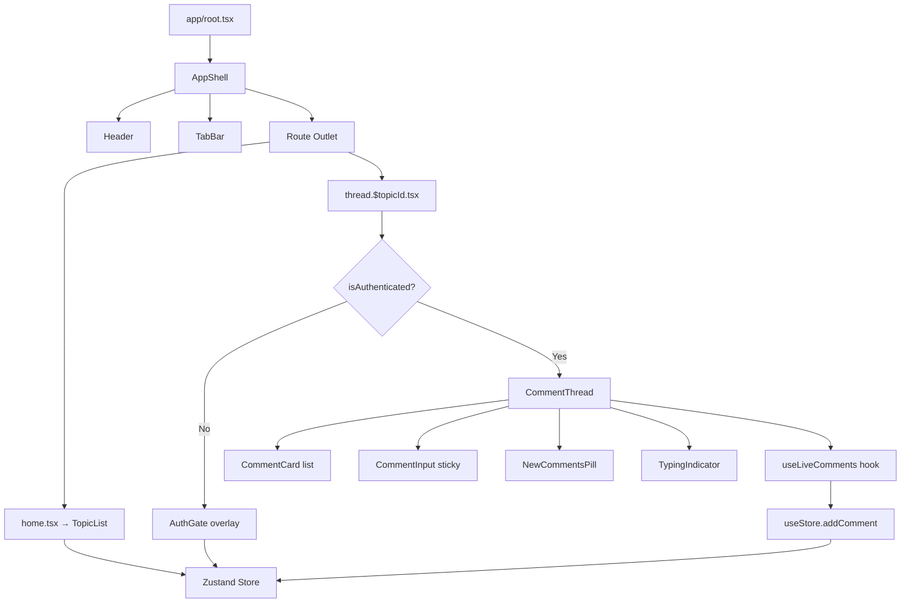
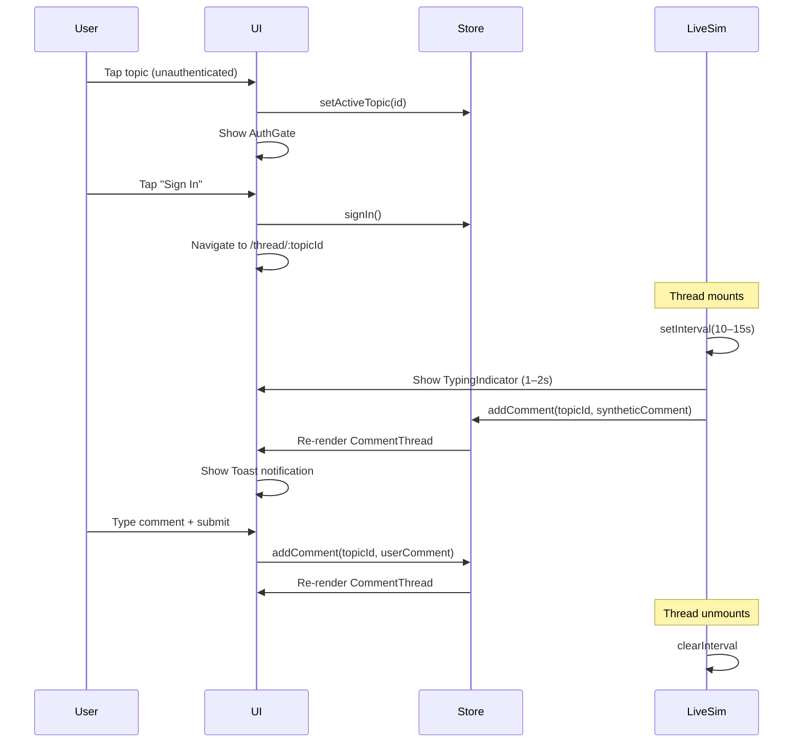

# Design Document: Open Talk Live Comments

## Overview

Open Talk is a pure-frontend SPA that simulates a live sports fan discussion hub. Users browse conversation topics, authenticate via a simulated auth gate, and participate in threaded comment feeds that receive auto-injected live comments every 10–15 seconds.

The application has no backend — all state lives in a Zustand store, all data is seeded from static files, and the "live" experience is driven by a client-side timer. React Router v7 handles file-based routing between two screens: the topic list (`/`) and the comment thread (`/thread/:topicId`).

Key design goals:
- Mobile-first, visually polished UI matching the Figma spec
- Predictable unidirectional data flow via Zustand
- Clean separation between UI components, state, and simulation logic
- Zero external UI libraries — all components hand-rolled with Tailwind CSS v4

---

## Architecture



### Data Flow



---

## Components and Interfaces

### Layout Components

**AppShell** (`app/components/layout/AppShell.tsx`)
- Wraps all pages with the cream background and max-width container
- Renders `Header` and `TabBar` at the top, then the route outlet
- Props: `children: React.ReactNode`

**Header** (`app/components/layout/Header.tsx`)
- Displays the hero banner: dark green background, golf image, "Open Talk / FANZONE" branding
- Static, no props

**TabBar** (`app/components/layout/TabBar.tsx`)
- Renders four tabs: Conversations, Games, News, Stats
- Reads `activeTab` from store; calls `setActiveTab` on tap
- Games/News/Stats taps are no-ops for navigation but update visual state
- ARIA role: `tablist`, each tab has `role="tab"` and `aria-selected`

### Feature Components

**TopicList** (`app/components/features/topics/TopicList.tsx`)
- Reads `topics` and `activeTopicId` from store
- Renders a `TopicCard` for each topic
- On tap: if authenticated → navigate to thread; else → show AuthGate

**TopicCard** (`app/components/features/topics/TopicCard.tsx`)
- Props: `topic: Topic`, `isActive: boolean`, `onClick: () => void`
- Renders title, subtitle, chevron icon
- Active state: green left border (`border-l-4 border-[#1A3A2A]`)

**AuthGate** (`app/components/features/auth/AuthGate.tsx`)
- Modal overlay rendered on top of TopicList when unauthenticated user taps a topic
- Props: `onAuth: () => void`, `onDismiss: () => void`
- ARIA: `role="dialog"`, `aria-modal="true"`, `aria-labelledby`
- Displays "Become part of the conversation", Sign In + Create Account buttons
- Backdrop click → `onDismiss`

**CommentThread** (`app/components/features/thread/CommentThread.tsx`)
- Reads `commentsByTopic[activeTopicId]` from store
- Renders scrollable list of `CommentCard` components
- Manages scroll position ref for auto-scroll logic
- Renders `NewCommentsPill` when user is scrolled up and new comments arrive
- Renders `TypingIndicator` when live sim is about to post
- ARIA: `role="feed"`, `aria-label="Comment thread"`

**CommentCard** (`app/components/features/thread/CommentCard.tsx`)
- Props: `comment: Comment`, `isNew: boolean`
- Renders avatar (initials circle), username, relative timestamp, message, like count
- `isNew` triggers fade-in + slide-up CSS animation
- Timestamp updates via `useEffect` interval (every 30s re-render)

**CommentInput** (`app/components/features/thread/CommentInput.tsx`)
- Props: `topicId: string`, `onSubmit: (text: string) => void`
- Sticky bottom, cream pill input
- Disabled submit when empty; Enter key submits
- Character counter (current/280); blocks input at 280
- ARIA: `aria-label="Write a comment"`, submit button `aria-label="Post comment"`

**NewCommentsPill** (`app/components/features/thread/NewCommentsPill.tsx`)
- Props: `count: number`, `onTap: () => void`
- Floating pill button showing unread count + down arrow
- Hidden when count is 0

**TypingIndicator** (`app/components/features/thread/TypingIndicator.tsx`)
- Props: `username: string`, `visible: boolean`
- Shows animated dots + "{username} is typing..."
- Rendered for 1–2 seconds before live comment appears

### UI Primitives

**Avatar** (`app/components/ui/Avatar.tsx`)
- Props: `username: string`, `size?: 'sm' | 'md'`
- Renders initials in a colored circle (color derived from username hash)

**Toast** (`app/components/ui/Toast.tsx`)
- Props: `message: string`, `visible: boolean`
- Auto-dismisses after 3 seconds
- Fixed position, top of screen

### Hooks

**useLiveComments** (`app/hooks/useLiveComments.ts`)
- Params: `topicId: string`
- Sets up `setInterval` (random 10–15s) on mount, clears on unmount
- Before injecting: sets `typingUser` state for 1–2s, then calls `addComment`
- Also triggers toast notification via local state passed up or via a store slice

### Routes

**home.tsx** (`app/routes/home.tsx`)
- Renders `TopicList` + conditionally `AuthGate` overlay
- Manages `showAuthGate` local state

**thread.$topicId.tsx** (`app/routes/thread.$topicId.tsx`)
- Reads `topicId` from params
- If not authenticated → redirect to `/` (or render AuthGate)
- Renders `CommentThread` + `CommentInput`

---

## Data Models

```typescript
// app/types/index.ts

export interface User {
  id: string
  username: string
  avatarInitials: string
}

export interface Topic {
  id: string
  title: string
  subtitle: string
}

export interface Comment {
  id: string
  topicId: string
  authorUsername: string
  message: string
  timestamp: number   // Unix ms
  likes: number
  isLive?: boolean    // true if injected by Live_Simulator
}

export interface StoreState {
  isAuthenticated: boolean
  currentUser: User | null
  topics: Topic[]
  activeTopicId: string | null
  commentsByTopic: Record<string, Comment[]>
  activeTab: string
  // actions
  signIn: () => void
  setActiveTopic: (id: string) => void
  addComment: (topicId: string, comment: Comment) => void
  seedComments: (topicId: string, comments: Comment[]) => void
  setActiveTab: (tab: string) => void
}
```

### Seed Data

**topics.ts** — 3+ static topics:
```typescript
export const SEED_TOPICS: Topic[] = [
  { id: 'masters-2025', title: 'Masters 2025', subtitle: 'Who takes the green jacket?' },
  { id: 'ryder-cup',    title: 'Ryder Cup Predictions', subtitle: 'Europe vs USA — your picks?' },
  { id: 'pga-tour',     title: 'PGA Tour Drama', subtitle: 'Latest news and hot takes' },
]
```

**mockComments.ts** — pool of synthetic sports-fan messages used by the Live_Simulator:
```typescript
export const MOCK_USERNAMES = ['GolfFan99', 'BirdieMaster', 'EagleEye', ...]
export const MOCK_MESSAGES = ['What a shot!', 'This is unbelievable golf', ...]
```

### Zustand Store Shape

```typescript
// app/store/useStore.ts
import { create } from 'zustand'

const useStore = create<StoreState>((set) => ({
  isAuthenticated: false,
  currentUser: null,
  topics: SEED_TOPICS,
  activeTopicId: null,
  commentsByTopic: {},
  activeTab: 'Conversations',

  signIn: () => set({
    isAuthenticated: true,
    currentUser: { id: 'me', username: 'You', avatarInitials: 'YO' }
  }),

  setActiveTopic: (id) => set({ activeTopicId: id }),

  addComment: (topicId, comment) => set((state) => ({
    commentsByTopic: {
      ...state.commentsByTopic,
      [topicId]: [...(state.commentsByTopic[topicId] ?? []), comment],
    }
  })),

  seedComments: (topicId, comments) => set((state) => ({
    commentsByTopic: { ...state.commentsByTopic, [topicId]: comments }
  })),

  setActiveTab: (tab) => set({ activeTab: tab }),
}))
```

### Routing Configuration

```typescript
// app/routes.ts (React Router v7 file-based)
import { type RouteConfig, index, route } from '@react-router/dev/routes'

export default [
  index('routes/home.tsx'),
  route('thread/:topicId', 'routes/thread.$topicId.tsx'),
] satisfies RouteConfig
```

---

## Correctness Properties

*A property is a characteristic or behavior that should hold true across all valid executions of a system — essentially, a formal statement about what the system should do. Properties serve as the bridge between human-readable specifications and machine-verifiable correctness guarantees.*

### Property 1: addComment appends to the correct topic only

*For any* store state with multiple topics, calling `addComment(topicId, comment)` should append the comment to `commentsByTopic[topicId]` and leave all other topics' comment arrays unchanged, with the target array growing by exactly one.

**Validates: Requirements 9.3, 6.5**

### Property 2: Empty and whitespace-only input is rejected

*For any* string composed entirely of whitespace characters (including the empty string), the CommentInput submit button should be in a disabled state and calling submit should not add any comment to the store.

**Validates: Requirements 6.2**

### Property 3: Character limit is enforced

*For any* input string of length ≥ 280 characters, the CommentInput should prevent additional characters from being appended, keeping the controlled value at exactly 280 characters.

**Validates: Requirements 6.7**

### Property 4: Input clears after submission

*For any* non-empty valid comment text submitted via Enter key or submit button, the CommentInput text field value should be the empty string after submission.

**Validates: Requirements 6.3, 6.4**

### Property 5: signIn sets isAuthenticated and currentUser

*For any* store state where `isAuthenticated` is `false`, calling `signIn()` should result in `isAuthenticated === true` and `currentUser` being a non-null User object with a valid username.

**Validates: Requirements 3.4**

### Property 6: Live simulator injects within the correct time window

*For any* mounted CommentThread, each synthetic comment injected by the Live_Simulator should arrive no sooner than 10 000 ms and no later than 15 000 ms after the previous injection (or after mount for the first injection).

**Validates: Requirements 7.1**

### Property 7: Live simulator clears its interval on unmount

*For any* instance of `useLiveComments` that has been mounted and then unmounted, `clearInterval` should be called exactly once with the interval ID that was created on mount.

**Validates: Requirements 7.5, 4.4**

### Property 8: New comments pill count matches unread injections

*For any* sequence of N live-injected comments while the user's scroll position is not at the bottom, the New_Comments_Pill count should equal N (the number of comments injected since the user last reached the bottom).

**Validates: Requirements 8.2**

### Property 9: Reaching the bottom resets the pill

*For any* state where the New_Comments_Pill is visible with count > 0, when the user either taps the pill or manually scrolls to the bottom of the thread, the count should reset to zero and the pill should no longer be visible.

**Validates: Requirements 8.3, 8.4**

### Property 10: CommentCard renders all required fields for any comment

*For any* Comment object, the rendered CommentCard output should contain the author's initials (avatar), username, a relative timestamp string (e.g., "just now", "2s ago", "1m ago"), the message body, and a reaction affordance (like count).

**Validates: Requirements 5.1, 5.2, 5.4**

### Property 11: Active tab receives the indicator style

*For any* tab name in {Conversations, Games, News, Stats}, when that tab is set as `activeTab` in the store, the rendered TabBar should apply the active indicator style to that tab and not to the others.

**Validates: Requirements 2.2**

### Property 12: ARIA attributes are present on key components

*For any* rendered instance of AuthGate, TabBar, CommentThread feed, and CommentInput, the required ARIA roles and labels should be present in the DOM (e.g., `role="dialog"` on AuthGate, `role="tablist"` on TabBar, `role="feed"` on the thread, `aria-label` on the input).

**Validates: Requirements 10.5**

---

## Error Handling

Since there is no backend, error scenarios are limited to client-side edge cases:

| Scenario | Handling |
|---|---|
| `topicId` param not found in store | Thread route shows "Topic not found" message and link back to home |
| `commentsByTopic[topicId]` is undefined | Treat as empty array; show empty-state message |
| Live simulator fires after unmount | `clearInterval` in `useEffect` cleanup prevents stale state updates |
| Comment submission with only whitespace | Submit button remains disabled; no store mutation |
| Input exceeds 280 chars | `maxLength` attribute + controlled input cap prevents overflow |
| User navigates directly to `/thread/:id` while unauthenticated | Redirect to `/` with `activeTopicId` set so AuthGate appears |

---

## Testing Strategy

### Dual Testing Approach

Both unit tests and property-based tests are required. They are complementary:
- Unit tests catch concrete bugs at specific inputs and integration points
- Property tests verify universal correctness across randomized inputs

### Property-Based Testing Library

Use **fast-check** (`npm install --save-dev fast-check`) — the standard PBT library for TypeScript/JavaScript.

Each property test must run a minimum of **100 iterations** (fast-check default is 100 runs).

Each test must include a comment tag in the format:
```
// Feature: open-talk-live-comments, Property N: <property text>
```

### Property Tests (one test per property)

| Property | Test Description |
|---|---|
| P1 | Generate random multi-topic store state + random topicId + random comment; assert only target topic grows by 1, others unchanged |
| P2 | Generate arbitrary whitespace-only strings; assert submit button disabled and store unchanged |
| P3 | Generate strings of length ≥ 280; assert input value capped at exactly 280 characters |
| P4 | Generate valid non-empty comment text; simulate submit; assert input value is `""` |
| P5 | Generate any store state with `isAuthenticated: false`; call `signIn()`; assert `isAuthenticated === true` and `currentUser !== null` |
| P6 | Mock timers; generate random delay values; assert all generated intervals are within [10000, 15000] ms |
| P7 | Mount and unmount `useLiveComments`; spy on `clearInterval`; assert it is called with the correct ID |
| P8 | Generate sequence of N injected comments while scrolled up; assert pill count equals N |
| P9 | Generate pill-visible state with count > 0; simulate bottom-scroll or pill tap; assert count === 0 and pill hidden |
| P10 | Generate random Comment with arbitrary timestamp; render CommentCard; assert output contains initials, username, relative time, message, and reaction |
| P11 | Generate random activeTab value from the four tabs; render TabBar; assert only that tab has the active indicator class |
| P12 | Render AuthGate, TabBar, CommentThread, CommentInput; assert required ARIA roles and labels are present |

### Unit Tests

Focus on:
- **AuthGate**: renders correct text, Sign In button calls `onAuth`, backdrop click calls `onDismiss`
- **TopicCard**: active state applies green border class, chevron is present
- **CommentThread empty state**: renders "Be the first to start the conversation" when list is empty
- **useLiveComments**: interval is cleared on unmount (spy on `clearInterval`)
- **Avatar**: correct initials extracted from username, color is deterministic
- **Routing**: unauthenticated direct navigation to `/thread/:id` redirects to `/`

### Test File Locations

```
app/
└── __tests__/
    ├── store.test.ts              (P1, P5 — pure store logic)
    ├── CommentInput.test.tsx      (P2, P3, P4 — component tests)
    ├── CommentCard.test.tsx       (P10 — rendering all fields)
    ├── NewCommentsPill.test.tsx   (P8, P9)
    ├── useLiveComments.test.ts    (P6, P7 — hook with mocked timers)
    ├── TabBar.test.tsx            (P11 — active tab indicator)
    ├── aria.test.tsx              (P12 — ARIA attributes)
    └── unit/
        ├── AuthGate.test.tsx
        ├── TopicCard.test.tsx
        └── CommentThread.test.tsx
```

### Test Runner

Use **Vitest** (already compatible with the Vite setup). Run tests with:
```
npx vitest --run
```
